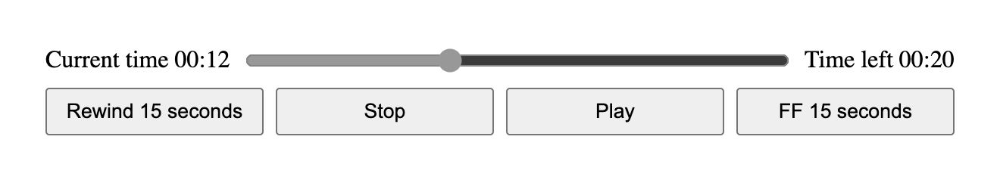

# Qwik Headless UI HLS Player



[Demo](https://obvio.github.io/qwik-headless-hls-player/)

## Project Structure

This project is using Qwik with [QwikCity](https://qwik.dev/qwikcity/overview/).

Inside your project, you'll see the following directory structure:

```
└── src/
    ├── components/
    │   └── ...
    └── routes/
        └── ...
```

- `src/routes`: Provides the directory-based routing.

- `src/components`: Contains the HLS Headless component directory.

## Development

Development mode uses [Vite's development server](https://vitejs.dev/). The `dev` command will server-side render (SSR) the output during development.

```shell
npm start # or `yarn start`
```
